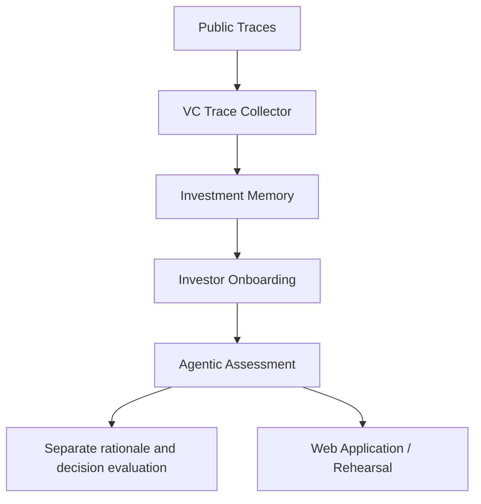

# VCLogic reviewer suite

VCLogic studies an evidence-grounded approximation of an investor’s observable evaluative logic. Reconstructing investment rationales and predicting investment decisions are separate research tasks. This repository coordinates five existing components at exact Git revisions; their scientific logic stays in their own repositories.

Run the no-key software demonstration with Python **3.12.12**, **uv 0.9.17**, and Git installed:

```bash
uv sync
uv run vclogic demo
uv run vclogic verify
```


Alternatively, run the CPU-only container:

```bash
docker compose up --build
```

The container runs the demo with networking disabled after its build. A warm demo took approximately 30 seconds on the audited Linux host; initial source/dependency downloads take longer. Successful execution prints `Validation passed` and leaves separate rationale and In/Out artifacts with evidence links. See [Docker](docs/docker.md) for image size and limitations.

The first run fetches pinned component sources and installs locked Python dependencies. It needs network access for setup, but no API keys, model weights or GPU. After setup, use `uv run vclogic demo --offline`. Runtime and download size depend on caches and platform; no cold-start duration is promised.

The demo validates a frozen Elizabeth Yin memory with the real validator, recomputes wiki-only onboarding, and runs the existing scripted Elizabeth/Thoras assessment example **in a separate workspace against its original input snapshot**. The new onboarding bundle is valid but **not assessment-ready** because indexes are deliberately skipped. The assessment uses a fake provider and contract v1. These stages are not a continuous same-snapshot pipeline and do not reproduce a publication’s findings.

Inspect `workspace/latest.json` for the latest run location. Each `workspace/runs/<id>/` contains `report.json`, a Markdown summary, provenance and stage logs. Verification checks recorded inputs and native artifacts; a successful smoke test establishes neither scientific accuracy nor human fidelity. Publication metric reproduction is unavailable until a coherent archive, human labels, analysis configuration and citation are supplied.

| Component | Responsibility |
|---|---|
| Trace Collector | Collect and review public evidence; not run by the default demo |
| Investment Memory | Build cited memories; demo validates a frozen memory |
| Investor Onboarding | Package, check and install memory bundles |
| Agentic Assessment | Retrieval, rationale investigation, decision synthesis and rehearsal |
| Web Application | UI consuming prepared assessment assets; optional |



Source URLs, full commits and local aliases are in [the component manifest](manifests/components.lock.json). Downloaded checkouts live under `.components/`; generated data lives under `workspace/`. Four component locks are preserved; memory validation uses the locked onboarding environment.

```bash
uv run vclogic components             # inspect exact pins
uv run vclogic components --fetch     # fetch all five components
uv run vclogic bootstrap --profile core
uv run vclogic doctor
```

Global path options precede the subcommand, for example `uv run vclogic --workspace /tmp/reviewer-output demo`. Research commands have their own explicit workspace/config options. See [the reviewer guide](docs/reviewer-guide.md), [architecture](docs/architecture.md), [reproducibility](docs/reproducibility.md), [full research workflow](docs/full-pipeline.md), [Docker](docs/docker.md), and [troubleshooting](docs/troubleshooting.md).

The [Phase 1 audit](docs/component-audit.md) is a historical record, including known compatibility issues and component test failures; its statements that the suite was not yet implemented describe that audit date. See [NOTICE](NOTICE.md) for unresolved rights and attribution. No publication citation or project-wide license grant has been provided.

See [implementation verification](docs/implementation-verification.md) for executed checks and remaining research-release boundaries.
