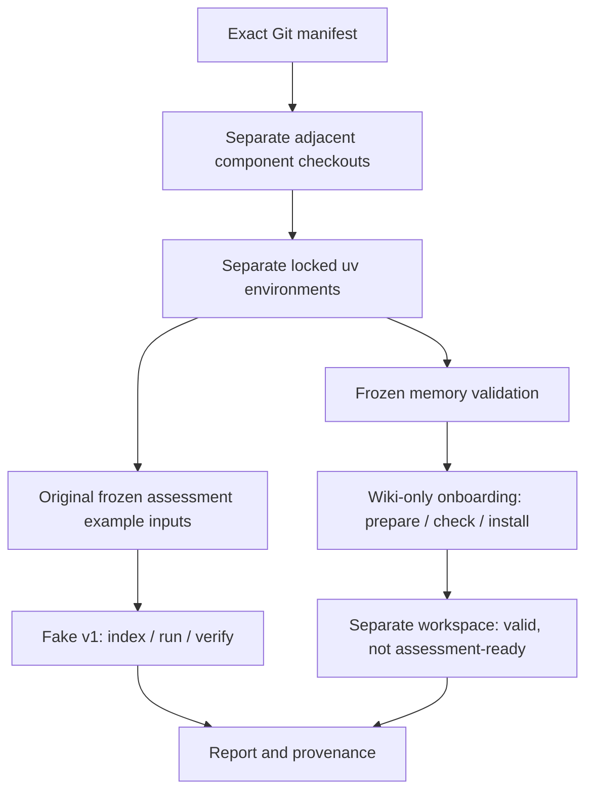

# Architecture

The suite is a standard-library orchestration layer. It resolves manifest pins, manages component environments, calls existing CLIs, checks readiness and writes an orchestration report. It does not implement collection policy, memory generation, retrieval, scientific artifact schemas or evaluation logic.

There is deliberately no arrow from the newly packaged bundle to the fake assessment. New onboarding defaults and the old scripted example use different contracts and input snapshots. Full research instead connects reviewed collector exports → validated memory → indexed onboarding bundle → assessment → optional web.

`manifests/components.lock.json` identifies all five repositories by full SHA, URL and destination. Fetching uses detached revisions, validates existing origins/HEADs/clean trees and refuses drift rather than overwriting local edits or falling back to a branch. The onboarding remote's misspelling is mapped to the intended local sibling name. Sibling layout matters because onboarding imports memory and assessment; web imports assessment.

Collector, onboarding, assessment and web retain their separate committed uv locks and environments. Memory has no upstream lock and runs through the onboarding environment. Core setup excludes optional embeddings, AV and research-model extras. The suite does not unify these potentially incompatible dependency stacks.

Ignored `.components/` holds code inputs. Ignored `workspace/runs/<id>/` holds isolated data/config copies, native outputs, logs and reports; `workspace/latest.json` identifies the last run. Source revisions and input hashes bind a run to its declared artifacts. Component-native validators remain authoritative for their own formats; the suite adds orchestration integrity checks.

The optional research adapters invoke existing rehearsal and web entrypoints against explicitly prepared native workspaces. The UI consumes ready assets; it neither creates a missing memory nor repairs incompatible embeddings. Readiness is distinct from bundle validity, HTTP health, credential presence and scientific coverage.
