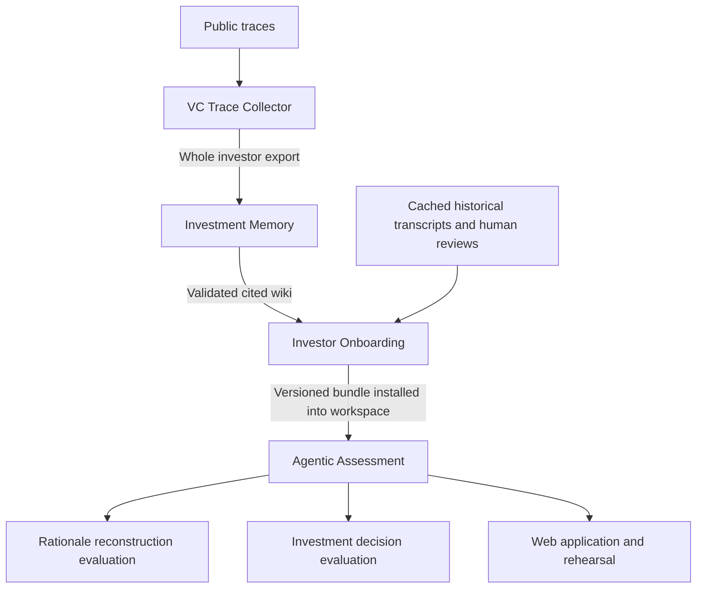

# VCLogic suite: Phase 1 component and integration audit

Audited **2026-10-07**. Scope: the five component repositories at the exact revisions below, plus the empty `VCLogic/vclogic-suite` repository. This document is the Phase 1 deliverable. **No suite CLI, dependency lock, container, component manifest, fixtures, or integration implementation has been created. No component source was changed.** Recommendations below are proposals, not delivered capabilities.

VCLogic models an **evidence-grounded approximation of an investor's observable evaluative logic**. Recovering rationales and predicting actual investment decisions are separate research tasks. A successful software smoke test establishes neither accuracy nor human fidelity. Publication reproduction must evaluate both tasks separately and preserve the distinction between source evidence, model inference, and human-reviewed outcomes.


Read this document by task: [architecture and handoffs](#existing-architecture-and-actual-handoffs), [executed verification](#verification-performed-in-phase-1), component audits ([collector](#trace-collector-source-and-runtime-audit), [memory](#investment-memory-source-and-runtime-audit), [onboarding](#investor-onboarding-source-and-runtime-audit), [assessment](#agentic-assessment-source-and-runtime-audit), [web](#web-application-source-and-runtime-audit)), [integration priorities](#integration-friction-and-release-priorities), [suite/reviewer/uv/Docker proposal](#proposed-minimal-suite-architecture-not-implemented), [full research workflow](#full-research-workflow-audited-sequence-and-prerequisites), [remaining decisions](#recommended-component-changes-and-remaining-decisions).

## Executive findings

- The components already have usable CLIs, validators, provenance artifacts and substantial tests. The suite should orchestrate them rather than rebuild their logic.
- The actual dependency graph differs from the conceptual pipeline: onboarding imports memory **and assessment**; web imports assessment; collector and memory exchange files, not package calls.
- The common declared Python range is **3.11–3.13**. Recommend **CPython 3.12.12**, the interpreter exercised here, for the initial suite/container pin. This audit is not a cross-platform or three-version compatibility certification.
- Four projects commit `uv.lock`. Investment Memory has a Python package but no lock and documents `venv`/`pip`. It can be invoked with uv without changing its scientific code. Preserve the four existing locks and isolate component environments.
- The existing assessment fake-provider example ran successfully without keys or downloaded models: 29 wiki sections indexed; separate Phase 1 rationales and Phase 2 decisions written; verifier passed. Its fixed responses and legacy v1 contract make it a **software demonstration, not publication analysis**.
- All 19 committed memories passed the memory validator. Onboarding can validate and package a frozen wiki without model calls using `--skip-indexes`; that is a valid but **not assessment-ready** bundle. Full readiness needs semantic indexes; live queries also need a compatible embedding backend.
- The strongest reviewer design is a no-key default combining an explicitly labelled mock smoke with validation/inspection of a separately archived publication artifact. Recomputing aggregate metrics from frozen real outputs is preferable to rerunning expensive, nondeterministic generation.
- Release blockers include missing archived canonical outputs, unidentified publication contract/configuration, rights/licensing decisions, and handoff compatibility issues described below. Existing package installation alone does not solve these.

## Audit method and exact source snapshots

The suite remote was cloned into `/home/dpasch01/vclogic-suite`; it was empty. Component shallow checkouts were placed outside the suite under `/tmp/vclogic-phase1-audit`. Their source and committed examples were inspected; lightweight installations, offline validations and tests were exercised. Package download access was allowed; no source crawling, paid inference, AV processing or model-weight download was performed. No credentials were requested or copied. Environment-variable names, not secret values, were inspected.

These are **observed audit revisions**, not a newly implemented release lock. A later `manifests/components.lock.json` should use full SHAs, repository URLs, package versions, roles and explicit destinations. Do not substitute branches at runtime.

| Component / source snapshot | Exact commit SHA | Package/version | Proposed checkout beneath `.components/` |
|---|---|---|---|
| [Trace Collector](https://github.com/VCLogic/vclogic-vc-trace-collector/tree/71f5284882ca33d07e5f6874124beb1950d0f14c) | `71f5284882ca33d07e5f6874124beb1950d0f14c` | `vc-trace-collector` 0.1.0 | `vclogic-vc-trace-collector` |
| [Investment Memory](https://github.com/VCLogic/vclogic-vc-investment-memory/tree/050c2470fc49c2aff6961f8562fa224e8467c7cd) | `050c2470fc49c2aff6961f8562fa224e8467c7cd` | `vc-investment-memory` 0.2.0 | `vclogic-vc-investment-memory` |
| [Investor Onboarding](https://github.com/VCLogic/vclogic-vc-inverstor-onboarding/tree/ca5019881d0eb807effc108f575e76c0a033e35f) | `ca5019881d0eb807effc108f575e76c0a033e35f` | `vclogic-vc-investor-onboarding` 0.1.0 | `vclogic-vc-investor-onboarding` |
| [Agentic Assessment](https://github.com/VCLogic/vclogic-vc-agentic-assessment/tree/296dc55768ea60ce3da464ae6bfd1940bbfef5c9) | `296dc55768ea60ce3da464ae6bfd1940bbfef5c9` | `vclogic-vc-agentic-assessment` 0.1.0 | `vclogic-vc-agentic-assessment` |
| [Web Application](https://github.com/VCLogic/vclogic-web-application/tree/013d862e0e595ea3414022731a5eb40b598e2e80) | `013d862e0e595ea3414022731a5eb40b598e2e80` | `vclogic-web-application` 0.1.0 | `vclogic-web-application` |

The onboarding **remote retains `inverstor`**. The proposed local alias `investor` follows existing component documentation and the web catalog's default sibling lookup; it does not rename GitHub. The audit checkout itself retained the remote spelling; explicit paths avoid ambiguity.

Source references in each component section are relative to that component's pinned tree above. They document inspected implementation, not assumptions from current branch README text. No tracked `AGENTS.md` was found in the component checkouts. Full data rights and dependency license review were not performed.

## Existing architecture and actual handoffs



Execution is not five daemons passing messages. Collector and memory are offline/batch producers with optional external calls. Onboarding packages files using the other libraries. Assessment owns retrieval, inference, rehearsal and validation. FastAPI invokes that engine in process and serves a separately built React frontend.

| Boundary | Actual artifacts and consumer | Invariants / cautions |
|---|---|---|
| Public material → collector | CLI identity/source arguments, local supplied text, web/feed/media URLs; identity/source review decisions | Identity and authorship/speaker decisions are explicit. Discovery results are not admitted evidence. Internet and AV requirements depend on selected sources. |
| Collector → memory | Whole `outputs/<slug>/`: `identity/resolved_identity.json`, `discovery`, `corpus/all_documents.jsonl`, `processed`, `raw`, `state`, `portfolio` | Preferred memory `inventory/full-build` uses more than the canonical corpus. Preserve original paths and metadata. Missing raw transcripts remain missing; memory does not transcribe them. |
| Collector portfolio → memory | `portfolio/documents.jsonl`, `portfolio/sources/*.json`, raw snapshots and `handoff.json` | Public portfolio source pages are not verified holdings. Full memory inventory reads source snapshots; legacy `prepare` expects a different `portfolio/portfolio.jsonl` verified-record contract. |
| Memory → onboarding | Entire validated `wiki/<slug>/`, including `_manifest.json`, `prepared.json`, `evidence.json`, required markdown; full-policy coverage/context/source reviews | Onboarding calls memory validator, snapshots source wiki, and selects markdown for runtime retrieval. Structural validity does not certify completeness, correctness, or absence of historical leakage. |
| Historical evidence → onboarding | Official Pitch Show collection or cache plus optional reviewed JSON rows | Machine decisions remain `machine-decisions.json`; human-reviewed labels go to `evaluation/labels`. Missing investment listing is Unknown, not Out. |
| Onboarding → assessment | `bundle.json`, investor registration TOML, curated wiki, taxonomy, canonical/rehearsal TOML, optional indexes and historical packages | Install into workspace, preserving `inputs/`, `configs/`, `evaluation/`; source wiki/collection remapped under `onboarding/<slug>/source`. `valid=true` differs from `ready_for_assessment=true`. |
| Assessment input boundary | `inputs/investors/<slug>.toml`; `inputs/data/investors/<slug>/pitches/<episode>.txt`, `audits/<episode>.json`, per-episode `manifests/<episode>.json` or legacy `source-manifest.json`; wiki/taxonomy | Firewall verifies paths, file hashes, approved/audited pitch, pitch hash, clean leakage checklist and target aliases. Do not hand-copy an arbitrary pitch into an existing hashed package. Rehearsal start is the existing new-pitch interface. |
| Assessment → evaluation | Frozen investigation/decision JSON, hashes, retrieval reads, input/config provenance; evaluation labels and run registries | Keep human target labels out of inference input tree. Archived runs referenced by registries are not present merely because the registry exists. |
| Assessment/onboarding → web | `--pipeline-workspace`, prepared bundle roots or installed receipts, configs, complete indexes, retained runtime snapshots | Web discovers/validates prepared assets; it does not run memory/onboarding or repair missing indexes. Backend imports engine directly. |

### Cross-repository incompatibilities requiring explicit treatment

1. **Legacy blog schema mismatch:** collector `export.py:43-102` writes blog text as `full_text`; memory `prep_corpus.py:73-74` reads `text`. Canonical modern exports use `text` and avoid this legacy mismatch. Do not advertise arbitrary legacy collector exports as equivalent inputs. Add a regression test/fix in the owning component if legacy support is retained.
2. **Manual attribution vocabulary:** collector eligibility (`policy.py:234-247`) admits `verified_human`; memory's curated `prepare` admission list (`prep_corpus.py:91-93`) admits `accepted_model`, `accepted_manual`, `verified`, `human_verified`, not `verified_human`. This can reject manually verified spoken evidence in the legacy/curated route. Full inventory/review is a separate route and must not be represented as a silent equivalent methodological workaround.
3. **Full memory source policy differs from curated policy:** `full_build.py:81-85` records `source_policy=full_investor_export` and calculates `no_pitch_sources`; `check_wiki.py:123-129` permits matching full-policy flags rather than universally requiring true. Full generation applies no date cutoff. Publication inference needs an explicitly reviewed admissibility/time/leakage policy, not merely a passing wiki validator.
4. **Different wiki generations:** newer memory wikis are not the same snapshots as assessment's committed older prepared wiki. Replacing one invalidates manifests/indexes and changes scientific inputs. Slugs can differ too: memory includes `phil-nadel-forefront-venture-partners`, assessment registry uses `phil-nadel`. Record mappings; do not infer identity solely from directory spelling.
5. **Onboarding's v4.1 defaults versus fake v1 demo:** the ready workflow and scripted demo are different contracts. Existing `DemoFakeProvider` hardcodes the Thoras episode and v1/v2 response shapes; it is not a generic fake for any investor/pitch or a drop-in v4.1 rehearsal provider. v4.4 has its own isolated Phase 1 fake path and explicitly disallows Phase 2. Never manufacture an In/Out result for a Phase-1-only contract.

## Runtime/environment comparison

| Component | Declared Python | Current environment workflow | Optional heavy/runtime requirements |
|---|---|---|---|
| Collector | `>=3.11,<3.14` | `uv.lock`; `uv sync` (dev group); `uv run vc-trace-collector ...` | Browser/Playwright; yt-dlp; ffmpeg/ffprobe; Whisper; gated pyannote/HF token; torch/torchaudio 2.8.0; optional external search tooling |
| Memory | `>=3.10` | No uv lock; README uses venv/pip; uv-compatible setuptools package | `full` extra pypdf; authenticated Codex CLI for generation; no embeddings or GPU requirement |
| Onboarding | `>=3.11,<3.14` | `uv.lock`; `uv sync --locked --extra dev`; editable memory+assessment siblings | `embeddings` for sentence-transformers; HTTP historical collection; OpenRouter automatic decision extraction |
| Assessment | `>=3.11,<3.14` | `uv.lock`; `uv sync --locked --extra dev` | `embeddings`, `tabular`, `setfit`, `graph`, `personalized`; optional local model servers/weights; research numerical workloads |
| Web | `>=3.11,<3.14` | `uv.lock` plus frontend `package-lock.json`; editable assessment sibling | Node README requirement 22.12+; React/Vite build via `npm ci`; engine embeddings/providers for live features |

There are no inspected component `.python-version` pins. Audit runtime was uv 0.9.17 and CPython 3.12.12; frontend checks used the available Node 25.8.2/npm 11.11.1, not a validation of the proposed Node 22 container. npm is technically necessary for the existing frontend; it is not a second Python environment manager. No reason was found to replace any component's package manager.


## Verification performed in Phase 1

These checks exercised current source at the pinned SHAs. Installation/build downloads are distinct from offline runtime; no model inference, model-weight download or public-data crawl was performed. Component tracked files remained unchanged. Generated dependencies, indexes, outputs and build files stayed in external audit checkouts or `/tmp`.

| Check | Observed result | Scope / limitation |
|---|---|---|
| Collector uv frozen offline base+dev install and CLI help | Passed | Cached dependencies; actual 17-command CLI available |
| Collector default non-live pytest | **258 passed, 3 failed, 2 deselected** (7.03s) | Three optional-pyannote dependency detection failures; not hidden as a green suite |
| Memory unittest | **53 passed** (0.212s) | Standard-library path, mocked generation |
| Memory real artifact validation | **19/19 committed memories passed** | Mechanical validity, not independent semantic/rights/coverage certification |
| Onboarding locked offline dev install, help, tests | **59 passed** (2.20s) | Cached dependency install; no embeddings |
| Real Elizabeth memory → onboarding → temporary workspace | **Passed**, valid=true, readiness=false | 43 bundle files; 44 installed incl. receipt; repeat installed zero; not a live-ready bundle |
| Assessment locked dev install; fake index/run/verify | **Passed** | 29 sections; scripted v1 Phase 1 and Phase 2, no model service |
| Assessment selected CLI/config/firewall/artifact/retrieval/provider tests | **345 passed** (91.97s) | Structural/mock integration coverage, not fresh real inference |
| Assessment full base+dev pytest | **1,683 passed, 18 skipped** (569.45s) | Optional torch/SetFit and missing archived canonical-output tests skipped |
| Web locked dev install and pytest | **168 passed, 3 skipped** (13.77s) | Archived-canary cases skipped; no live provider |
| Frontend npm lock install and Vitest | **102 passed**, 26 files (5.47s) | Node 25.8.2 / npm 11.11.1; no Playwright browser run |
| Frontend production TypeScript/Vite build | **Passed** | Nonfatal >500 kB JS chunk warning |
| Web actual CLI startup + loopback HTTP | **Passed**, `/api/health` and `/` 200 | Six installed profiles, **zero ready investors**: five missing indexes, one embedding mismatch |

Selected reproducible audit commands (run from respective component checkouts, with the other checkouts adjacent):

```bash
# Collector; external venv selected during audit, frozen lock and cached packages.
uv run --offline --frozen --group dev pytest -q
uv run --offline --frozen vc-trace-collector --help

# Memory has no lock yet; these commands use its source and standard library only.
uv run --no-project --python 3.12 python -m unittest discover -s tests -v
uv run --no-project --python 3.12 python -m wiki_build check wiki/michael-hyatt
uv run --no-project --python 3.12 python -m wiki_build check wiki/mac-conwell

# Onboarding audit selected an external uv environment; its pytest/CLI were
# subsequently executed directly from that uv-created environment.
uv sync --locked --offline --extra dev
# Equivalent ordinary project invocation for the same tests:
uv run --locked --extra dev pytest -q -p no:cacheprovider

# Assessment
uv sync --locked --extra dev
OPENBLAS_NUM_THREADS=1 OMP_NUM_THREADS=1 MKL_NUM_THREADS=1 uv run --locked --extra dev pytest -q
uv run --locked --extra dev pytest -q tests/test_cli.py tests/test_config.py tests/test_firewall.py tests/test_artifacts.py tests/test_retrieval.py tests/test_providers.py

# Web backend
uv sync --locked --extra dev
uv run --locked --extra dev pytest -q
# Frontend subdirectory web/frontend:
npm ci --no-audit --no-fund
npm test -- --run
npm run build
# Back at web repository root, after building:
uv run --locked vc-clone-web --pipeline-workspace ../vclogic-vc-agentic-assessment --port 18766
```

All-19 memory validation used `wiki_build.check_wiki.validate(Path)` over each `wiki/` directory via uv-managed Python 3.12. No expensive/external tests were enabled to make skip counts disappear. The suite has no `pytest` command or runnable demo yet; the commands above are existing component audit evidence.


## Trace Collector: source and runtime audit

Audit date: 2026-10-07. Checkout: `/tmp/vclogic-phase1-audit/vclogic-vc-trace-collector`. Commit: `71f5284882ca33d07e5f6874124beb1950d0f14c`. No AGENTS.md found in this checkout or sibling audit tree. No tracked component files changed; final `git status --short` was empty. References below are checkout-relative, with source line numbers. Scope was code inspection and offline tests; no public crawl, live test, model download, or inference was performed.

### Role and actual entrypoints

Python package `vc-trace-collector` version 0.1.0; installed command `vc-trace-collector = vc_trace_collector.cli:app` (`pyproject.toml:1-35`). It collects auditable investor public traces and exports source material; it does not build a digital-twin memory itself. Actual Typer commands, confirmed by executing top-level `--help`: wizard, stage-reference, portfolio, doctor, discover, review, search-source, list-sources, fetch-source, collect, process, process-source, export, review-voice, status, verify (`cli.py:56-672`).

Normal staged path: discover → review (identity confirmation and source decisions) → fetch-source/collect → process → export → verify. `collect` also orchestrates stages, supports `--resume`, `--collection-only`, `--processing-only`, `--export-only`; these execution-only modes are mutually exclusive (`cli.py:435-530`). `collect` returns code 3 for review required, 4 for budget exceeded, 1 for failed verification. `export` automatically verifies and exits 1 on failure (`cli.py:613-623`). Review accepts a JSON list of SourceDecision records; unattended use must supply explicit `--confirm-identity` to avoid a prompt (`cli.py:263-328`). A stage-reference command only records a local approved reference and instructs a subsequent fetch (`cli.py:82-97`).

### Runtime and dependencies

Requires Python >=3.11,<3.14; uv.lock repeats that constraint and contains platform/Python resolution markers (`pyproject.toml:5`, `uv.lock:1-15`). Build backend hatchling. Base dependencies: beautifulsoup4, ddgs, feedparser, httpx, pydantic 2, python-dotenv, questionary, rich, typer. Dev group pytest/pytest-cov/ruff. Optional extras: browser→playwright; youtube→yt-dlp; av→numpy/scipy/soundfile; av-local→huggingface-hub<1, openai-whisper, pyannote-audio>=3.3,<4, torch==2.8.0, torchaudio==2.8.0 (`pyproject.toml:6-42`). Separate environment strongly preferable for integration; installing AV extras is materially heavier than the functioning base text pipeline.

Media needs system ffmpeg/ffprobe; doctor also inspects yt-dlp, agent-reach, mcporter (`capabilities.py:124-140`). Doctor invokes `agent-reach doctor --json` if installed, so it was not run as an indiscriminately offline probe (`capabilities.py:58-66`). Whisper constructor calls `whisper.load_model`; pyannote constructors load pretrained models, so these are download/inference boundaries (`av.py:476-485,522-537`). Those constructors were not manually exercised.

Default discovery searches DDG, with SearXNG override and yt-dlp for YouTube; Agent Reach/Exa is a separate factory (`public_search.py:333-349`). Portfolio defaults to `--backend agent-reach`, unlike normal discovery; it can select `default` (`cli.py:101-104,130-131`). Thus base install does not establish every advertised search/backend capability.

### Configuration and environment names

CLI loads only cwd `.env`, `override=False` at app creation (`cli.py:36-37`). Environment names inspected, not secret values: `VC_TRACE_SEARCH_ENDPOINT`, `VC_TRACE_LLM_ENDPOINT`, `VC_TRACE_LLM_API_KEY`, `VC_TRACE_DISCOVERY_MODEL`, `HF_TOKEN`, `VC_TRACE_AV_DEVICE`, `VC_TRACE_ALLOW_ENV_PROXY`; `.env.example` additionally lists `NODE_USE_ENV_PROXY`. Fetch checks `HTTPS_PROXY`, `https_proxy`, `HTTP_PROXY`, `http_proxy` only under explicit proxy trust (`fetch.py:75-80`). Discovery LLM config is read in `pipeline.py:398-400`; HF/device use at `pipeline.py:1297-1304,1422-1423`. The suite should pass configuration explicitly and control cwd, because invoking even help imports the CLI and reads cwd dotenv.

RunConfig forbids extra fields; freezes person/name/firm, profile and source URLs, supplied files and role, output root, exclusion policy, model names, cost/media/download/provider budgets, public search flag, automatic discovery, partial-run policy and resume (`config.py:17-56`). Public search defaults true; automatic discovery and partial run false. Default limits: $10, 20 search operations, 120 media minutes, 1GB download, 100 provider operations. `config/defaults.toml` exists, but source search found no automatic loader/reference to that filename; do not assume editing it configures CLI runs. Exclusion TOML is explicitly loaded via CLI helper and load_toml (`cli.py:32`, `config.py:59`).

### Inputs and schemas

Discovery CLI takes investor name, optional firm/profile/source URLs and repeatable supplied files with material-role annotation (`cli.py:189-260`). Supplied collector snapshots local file bytes and records source path/MIME/original name (`collectors.py:618-647`). Processing branches explicitly cover XML/feed, HTML and text/markdown (`process.py:261-298`); arbitrary supplied bytes should not be assumed to become useful documents. Registry has web, feed, podcast, supplied/LinkedIn-export and YouTube collectors; SourceType enum includes X, but registry is not evidence of a dedicated X collector (`collectors.py:884-892`, `models.py:28-38`).

Pydantic StrictModel uses extra=forbid (`models.py:17-18`). Core schemas:

- ResolvedIdentity v1.0: slug, canonical_name, aliases, affiliations, authoritative_profiles, status/confidence, evidence IDs, competing hypotheses, reviewer/time (`models.py:102-114`).
- SourceCandidate v1.0: candidate_id, URL/canonical_url, source type, material role, title/description/channel/programme/company, discovery queries/evidence, confidences, estimates, approval decision and speaker reviewer (`models.py:133-157`). SourcePlan embeds candidates and review state (`160-169`). SourceDecision contains candidate_id/status/reason/decided_by and optional role/speaker/override/duration metadata (`172-184`).
- RawArtifact v1.0: artifact_id, relative_path, SHA256, size, MIME, source URL/path, collection method/time/version, parents, metadata, optional rights notes (`187-202`).
- CanonicalDocument v1.0: source_item_id, content_hash, document_version_id, investor_slug, source_candidate_id, nonempty raw_artifact_ids, canonical_url/local_source_path, source_type, modality, material_role, title/authors/speakers/publication metadata, collected_at, text, extraction method/version, transcript info, speaker attribution, identity confidence, inclusion/exclusion/duplicate metadata (`257-285`).
- CollectionManifest v1.0 binds investor identity, config/exclusion hashes, file path/hash/size/record counts, corpus/excluded counts, fingerprint (`386-402`). QualityReport and RunSummary carry checks/counts/metrics/warnings and run outcomes/budgets (`405-442`).

### Output contract and memory handoff

Workspace under output root / investor slug. Export writes `processed/documents.jsonl` (all canonical documents), `processed/target_speech.jsonl`, `processed/excluded_documents.jsonl`, `corpus/all_documents.jsonl` (eligible canonical documents), and compatibility `blog.jsonl`, `talks.jsonl`, `_manifest.json` both under corpus/ and workspace root (`export.py:160-178`).

Exact legacy rows (`export.py:43-102`): blog `{doc_id, title, source, full_text}`; talk `{doc_id, video_id, source, text}`, source is youtube_talk for YouTube, otherwise talk. `_manifest.json` contains blog_docs, talk_docs, corpus_chars, thin_corpus (<600,000 characters), pitch_excluded, channel_unknown, no_pitch_sources. No schema_version is written in this compatibility manifest. These compatibility rows omit canonical URL, original hashes, timestamps and most provenance; a memory importer needing source-linked evidence must retain canonical records or map doc_id back to them. Do not ingest both root and corpus compatibility copies or both canonical and legacy views as independent documents.

Eligibility requires included status and authored_by_target or spoken_by_target; speech additionally requires verified_human or accepted_model attribution, authored text requires not_applicable attribution (`policy.py:234-247`). Therefore raw or processed files are not interchangeable with eligible corpus. Export emits quality_report.json and collection_manifest.json, covering corpus, processed data and provenance/state snapshots (`export.py:347-414`). Verification independently validates manifest, identity/config, reviews/plans, raw/cache provenance, attribution, documents, quality report and budgets (`verify.py:210-1340`).

Other workspace artifacts include `config_snapshot.json`, `exclusion_rules_snapshot.json`, identity evidence/review/reference voice files, discovery plan/decisions/candidates, raw artifacts+metadata, audit events/costs/failures/run records, stage cache JSONs and SQLite operation state (`pipeline.py:497-516`, `export.py:374-391`, `storage.py:201-224`). Full workspace is the appropriate archival unit; legacy JSONL files alone are an intentionally lossy handoff. Downstream memory consumption itself is outside this checkout and was not claimed verified here.

Separate portfolio handoff must stay distinct from memory corpus: `portfolio/documents.jsonl` contains PortfolioEvidence `{source_id,source_url,final_url,title,text,published_at,collected_at,raw_path,content_sha256,metadata_sha256}` (`portfolio.py:36-46`). `portfolio/handoff.json` schema_version 1.0, dataset_type public_portfolio_evidence, investor object, relative documents/sources/raw/manifest/status paths, extraction_performed=false, corpus_exclusions_applied=false (`portfolio.py:383-398`). Publication dates are explicitly not investment dates; company/date extraction and identity validation are downstream work. Manifest lists file path/SHA256; run summary reports bounded coverage and failures (`portfolio.py:365-428`). This is not a structured investment list.

### Executed checks and offline viability

Executed with environment outside component checkout:

`UV_PROJECT_ENVIRONMENT=/tmp/vclogic-phase1-audit/collector-venv uv run --offline --frozen --group dev pytest -q`

uv selected CPython 3.12.12, built editable project from checkout, installed 38 cached packages, without network resolution/download. Result **258 passed, 3 failed, 2 deselected in 7.03s**, exit 1. Default pytest config deselects live tests (`pyproject.toml:44-47`). All failures were `tests/test_av_local_dependencies.py`: line 14 and parameterized line 39 call `importlib.util.find_spec('pyannote.audio')` and raise ModuleNotFoundError when parent `pyannote` is absent. These appear to intend skipping absent optional dependencies but cannot reach that path. This is a concrete base+dev test friction, not a finding that text runtime needs AV extras. No fix was made and no heavyweight extra was installed to mask it.

Executed `UV_PROJECT_ENVIRONMENT=/tmp/vclogic-phase1-audit/collector-venv uv run --offline --frozen vc-trace-collector --help`: exit 0, expected 17 commands listed. Tests include mocked HTTP fixtures and a full supplied-text pipeline with explicit human authorship decision, identity confirmation, verified export and exact compatibility text assertion (`tests/test_pipeline_cli.py:833-866`; helper mock transport at line 72). That test passed as part of 258. Fixture HTML/feed are checked in under tests/fixtures. This demonstrates offline deterministic text path with mocks, not production identity/discovery accuracy. A no-network production smoke should explicitly disable public search, avoid URL inputs and optional discovery model config, and supply local text; public search disabled alone still allows explicitly supplied URLs to be fetched.

### License and integration friction

NOTICE.md:24-26 explicitly says no project-wide redistribution license. Source-media rights remain with owners; provenance does not confer redistribution rights (NOTICE.md:19-22). No LICENSE file discovered and no project license declaration in pyproject. This audit makes no dependency license compatibility claim; lockfile installation is not a license review.

Priority integration findings: (1) base+dev test baseline has three concrete optional-dependency skip failures; (2) contract choice must be deliberate: canonical eligible corpus versus lossy legacy source rows, separate portfolio evidence; (3) preserve verification/provenance and do not silently import pending/excluded/unknown-role text; (4) Python/AV dependency isolation is needed before combining component environments; (5) default public discovery is networked and portfolio defaults to external Agent Reach; (6) cwd dotenv and interactive review need explicit orchestration; (7) no evidence in this component alone establishes the next repository accepts its exported schema; validate that at suite boundary; (8) project redistribution licensing remains undecided by owner. Component is viable for offline text-based suite fixture integration, with these bounded caveats, without inference or AV installations.

## Investment Memory: source and runtime audit

Pinned source: [050c247](https://github.com/VCLogic/vclogic-vc-investment-memory/tree/050c2470fc49c2aff6961f8562fa224e8467c7cd). Package `vc-investment-memory` 0.2.0, import `wiki_build`. Layout: root `wiki_build/`, `tests/`, `wiki/` (19 generated memories, approximately 81 MiB in this checkout), `supplements/`, `docs/`, shared agent skill under `.agents/skills/investor-memory` and Claude symlink. Raw exports in `data/` and generation cache `.wiki-cache/` are ignored. No direct sibling Python dependency, Node application, lockfile, Python patch pin or license grant is present.

**Installation and commands.** `pyproject.toml` uses setuptools>=61, Python>=3.10, no mandatory dependencies, optional `full=[pypdf>=5,<7]`. The README currently documents manual venv/pip; this is the only component not already documenting uv. A future upstream lock can support `uv sync --locked --extra full`; this is a proposal, not an existing locked command. For this audit, standard-library-only operations used `uv run --no-project --python 3.12 python ...` from the checkout, without generating a lock or modifying metadata. Onboarding's own existing lock also installs this sibling reproducibly as a dependency.

Entry point is `investor-memory = wiki_build.__main__:main`; equivalent `python -m wiki_build`. Actual subcommands (`__main__.py:12-42`):

- `inventory INVESTOR_DIR [--output FILE]`: full file census/extraction, no model call.
- `full-build INVESTOR_DIR --output DIR [--cache-dir DIR --model MODEL --timeout SECONDS --workers 1..8 --reviews FILE --inventory FILE --identity-resolutions FILE --supplements FILE]`: full review and synthesis.
- `prepare INVESTOR_DIR [--output FILE]`: older curated-only deterministic preparation.
- `build INVESTOR_DIR --output DIR [--cache-dir DIR --model MODEL --timeout SECONDS --batch-chars N]`: older curated-only generation.
- `check WIKI_DIR`: JSON `{valid,errors}`, exit 1 on invalid, 0 on valid.

Generation output must be new and disjoint from input; cache cannot be inside input/output. Relative arguments and `.wiki-cache` default depend on working directory. There is no configurable TOML application file: argparse flags, `config.py`, packaged `taxonomy.json`, `AGENT.md`, and `FULL_AGENT.md` define generation. `MODEL='gpt-5.6-sol'`, batch size 30,000 characters, thin-corpus threshold 600,000 characters. Preserve/hash these files as methodological inputs.

**Inputs and admission.** `inventory.py:54-61` requires confirmed identity and a slug matching directory name. It accounts for discovery metadata, canonical/processed documents, aligned diarized transcripts (`processed/av_attribution_results.jsonl`), saved source sidecars, HTML/PDF and portfolio source snapshots. Origins preserve relative file/line references, URL, source identity and content hashes. Search/discovery files are not treated as collected evidence. HTML extraction is standard-library based; PDF extraction imports optional pypdf, recording extraction failures rather than pretending success. Missing AV transcripts stay a coverage limitation; there is no Whisper integration here.

The older `prepare` accepts canonical corpus or legacy blog/talk JSONL guarded by `no_pitch_sources=true`. It filters roles, duplicate text, wrong investor, excluded records and speaker attribution. It can tolerate a missing identity with a warning, unlike full inventory. It expects legacy portfolio records with `verification_status=verified`, `identity_match=supported`, source URL, distinct from the collector's current raw portfolio-evidence contract (`prep_corpus.py:39-149`). See the cross-repository incompatibilities above; do not infer interchangeable admission policies.

**Generation and services.** `generator.py:32-112` caches model/schema/prompt keyed calls, revalidates raw/cached output and performs bounded repair. Its actual external boundary is an installed, authenticated **`codex exec` subprocess**, using `--ignore-user-config --ephemeral --skip-git-repo-check --model ... --sandbox read-only --json --output-schema ... --output-last-message ...`, medium reasoning, isolated temporary cwd and stdin prompt. Source text is sent to the model. There is no memory-specific API-key environment variable or dotenv loader in this code; Codex owns authentication. Node requirements for externally installed Codex are not pinned by this repository. The default model identifier's ongoing availability was not tested. Online generation uses inference entitlement and may incur cost; it cannot be assumed free because no API key is passed directly. Processes use POSIX session/process-group termination (`os.killpg`), a portability concern for native Windows.

No embeddings, local model weights, GPU or sibling package is required for validation. Generation needs backend connectivity and can be substantial: every admitted source packet is reviewed before synthesis. A complete cache can avoid some calls, but a cache hit rate is not a guarantee of zero inference; reviewer mode should call `check`, not `full-build` with hope of cache reuse.

**Outputs.** Full-build `prepared.json` uses schema 2.0 / `source_policy=full_investor_export`, with source text, identity, input hashes, documents and portfolio. `evidence.json` binds quote/interpretation/label/direction/support to source and normalized offsets. Rendered `evidence/<dimension>.md`, `persona.md`, `theses.md`, `portfolio_and_constraints.md`, `sources.md`, `README.md`, context, coverage, inventory, reviews, `BUILD_REPORT.md`, `_manifest.json` and `validation.json` make the result inspectable. Source quotations use `[ev:...]`; source-reported context uses `[ctx:...]`. `check_wiki.validate` verifies source-text hashes, quotations, offsets, deterministic evidence pages, citation resolution, manifest counts and full-artifact coverage. It does not establish semantic truth or certify human likeness. Generated snapshots contain substantial third-party text even though raw media is ignored.

**Tests and candidate data.** All 53 unittest cases passed with `uv run --no-project --python 3.12 python -m unittest discover -s tests -v`. All 19 committed wiki directories separately returned no validator errors; Michael Hyatt and Mac Conwell also passed the public `check` CLI. These tests are local and use test doubles rather than a real Codex generation call. The README has Hyatt and Mac full-run examples plus an October 2026 batch of 17 text-based partial memories. Elizabeth's memory is approximately 2.7 MiB; Hyatt 7.9 MiB; Mac 15 MiB. Size is not the selection criterion: identity coverage, rights, temporal policy and the published analysis's exact snapshot matter. The supplied supplements are source-specific receipts/transcripts, not generic generation fixtures.

**Recommendation.** Freeze a validated memory for reviewer use; do not regenerate it by default. Add an upstream uv lock/documentation and correct the two curated importer compatibility issues with regression tests. Preserve full-vs-curated policy and coverage warnings. Audit rights before copying source-containing artifacts into a release. No changes were made during this audit.


## Investor Onboarding: source and runtime audit

Audit date: 2026-10-07. Checkout `/tmp/vclogic-phase1-audit/vclogic-vc-inverstor-onboarding`; HEAD `ca5019881d0eb807effc108f575e76c0a033e35f`. All source references below are relative to that checkout. No component source modifications, model downloads, paid inference, or live collection performed. No tracked AGENTS.md or LICENSE file; no AGENTS.md found in checkout or temporary-directory ancestors. Git status initially clean.

### Role and actual integration contract

This is a Python CLI packaging an already generated, valid investment-memory wiki into assessment-native inputs. It does not build the wiki, run assessments, or provide a web/API server. Its four commands are `investor-onboarding prepare|index|check|install`; equivalent module entry is `python -m vclogic_onboarding` (`pyproject.toml:12-13`, `src/vclogic_onboarding/cli.py:11-33`, `__main__.py`). Input can additionally include official Pitch Show evidence or a cached scrape and human review JSON. Output is a versioned, hash-inventoried bundle; installation is a separate explicit operation.

The repository checkout spelling `vclogic-vc-inverstor-onboarding` differs from package/distribution and README's `vclogic-vc-investor-onboarding`. Suite mapping must record the actual misspelled remote explicitly and use a deliberate local checkout alias; the recommended alias is the documented `vclogic-vc-investor-onboarding`. Imports use `vclogic_onboarding`.

### Runtime, packaging, and dependencies

- Python `>=3.11,<3.14`; hatchling wheel backend; version 0.1.0 (`pyproject.toml:1-24`). `uv.lock:1-7` is lock format 1/revision 3, with Python 3.11 versus >=3.12 resolution branches.
- Required direct packages: `vc-investment-memory>=0.2,<0.3`, `vclogic-vc-agentic-assessment>=0.1,<0.2`, `httpx>=0.28,<1`, `beautifulsoup4>=4.12,<5`. Dev extra is pytest >=8,<10; embeddings extra forwards the assessment embeddings extra (`pyproject.toml:6-10`).
- Hard editable source locations are `../vclogic-vc-investment-memory` and `../vclogic-vc-agentic-assessment` (`pyproject.toml:15-17`, `uv.lock:1851-1938`). Lock records memory 0.2.0 and assessment 0.1.0. It does not pin sibling Git commits. Suite must separately pin revisions and keep the sibling layout.
- Assessment's mandatory transitive stack includes langgraph/checkpoint-sqlite, numpy, openai, pydantic, python-dotenv, rank-bm25, scikit-learn, scipy (`uv.lock:1860-1875`); wiki-only mode is therefore not a tiny standalone package. Pydantic is directly imported by extraction but supplied transitively by assessment (`extraction.py:9`).
- CLI eagerly imports bundle, which imports assessment and memory at module import (`cli.py:8`, `bundle.py:11-16`). Even `--help` requires those packages. Both sibling checkouts must exist for uv project resolution.
- `embeddings` resolves sentence-transformers through assessment (`uv.lock:1878-1897`). Do not use all extras for the no-model offline suite lane. `_embedder` is lazy and only invoked during index building (`bundle.py:29-34,49-56`).

### CLI contract and execution boundaries

`prepare` requires `--wiki PATH --output PATH`. Optional identity flags: `--slug`, `--display-name`, `--firm`, `--role`, repeated `--alias`. Historical options: `--from-pitch-show`, `--pitch-show-slug`, `--pitch-show-cache`, `--max-episodes`, `--collect-only`, `--decision-model`, `--review`; `--skip-indexes` suppresses embeddings (`cli.py:14-27`). All Pitch Show options require from-pitch-show; collect-only conflicts with decision-model (`bundle.py:70-77`). `--max-episodes` must be a positive integer and caps matching retained episodes, not HTTP requests (`pitch_show.py:59-61,150-161,180-217`).

`check --bundle PATH` validates without constructing a model. Index metadata is checked using `_IndexIdentity` (`bundle.py:24-26,171-176`). `index --bundle PATH` builds indexes and stages replacement to preserve prior bundle on failure (`bundle.py:182-194`). `install --bundle PATH --pipeline-workspace PATH` validates the bundle and copies assets into an existing, separate directory (`bundle.py:209-248`).

CLI emits JSON stdout, diagnostics stderr; handled operational errors return 1, argparse usage errors 2, KeyboardInterrupt 130 (`cli.py:36-59`). Successful check returns 0 even if `ready_for_assessment` is false. Successful install likewise can install an incomplete bundle; readiness is returned, not enforced (`bundle.py:177-179,247-248`). Suite must inspect JSON readiness and capabilities, not only exit code. Install checks only that workspace is an existing directory, not an assessment checkout.

### Environment and external services

Explicit configured credential NAME is `OPENROUTER_API_KEY` (`resources/canonical.toml:10-18`, `resources/rehearsal.toml:11-18`). README describes environment or repo `.env`; this component does not itself load dotenv and delegates credential behavior to assessment's OpenRouterProvider (`extraction.py:35-40`). No credential values were inspected. `.env`, `.env.*`, bundles, caches, dist are ignored (`.gitignore`).

Pinned config defaults: OpenRouter base URL `https://openrouter.ai/api/v1`, model `openai/gpt-5.6-luna`; local embedding `nomic-ai/nomic-embed-text-v1.5` revision `e9b6763023c676ca8431644204f50c2b100d9aab`, normalized vectors, document/query prefixes (`resources/canonical.toml:10-29`). These are source configuration facts, not claims of present remote availability. Extraction only forwards selected model and output token cap to OpenRouterProvider, so other provider settings come from assessment provider defaults (`extraction.py:35-40`).

Collection uses `https://www.thepitch.show`, official HTTPS hosts only, port 443/default, bounded redirects and 12 MiB per response; `httpx.Client(timeout=30, follow_redirects=False, trust_env=True)` (`pitch_show.py:17-32,75-116`). Thus standard HTTPX proxy/certificate environment variables apply (e.g. HTTP_PROXY, HTTPS_PROXY, ALL_PROXY, NO_PROXY, SSL_CERT_FILE, SSL_CERT_DIR), but these names are not component-specific settings. `OMP_NUM_THREADS` and `MKL_NUM_THREADS` occur only in prior validation commands (`docs/validation/2026-09-23-automatic-precedents.md:38`).

Crucial boundary: `--skip-indexes` alone does NOT suppress paid extraction. `--from-pitch-show` without `--collect-only` constructs a provider before wiki validation and performs automatic extraction. For a fully offline no-model run use wiki-only `prepare --skip-indexes`, or cached Pitch Show `prepare --from-pitch-show --pitch-show-cache ... --collect-only --skip-indexes`. Live collect-only still performs network GETs. `index` normally downloads/loads embeddings; no public CLI deterministic/mock embedder option exists, although Python functions accept injected embedder objects for tests.

### Input and output schema details

Input wiki must pass `wiki_build.check_wiki.validate`; `_manifest.json` and `prepared.json` must agree on `vc_slug`. Display name defaults from `prepared.identity.canonical_name`; aliases merge canonical name, prepared aliases and explicit aliases; slug uses assessment `safe_slug` (`bundle.py:37-40,78-89`). Original wiki is copied and validated again. Curated retrieval wiki selects persona.md, theses.md, portfolio_and_constraints.md, sources.md, context.md, and evidence/*.md (`bundle.py:93-105`). Firm defaults empty and role Investor; employment is not inferred.

Bundle schema literal is `vclogic-investor-bundle-v1`; metadata includes vc_slug, display_name, creation/source timestamps, source warnings, readiness, capabilities, eligible_pitches, collection summary, optional dataset/extraction summaries, and SHA256 file inventory (`bundle.py:21,43-46,107-111`). Inventory excludes bundle.json itself (`files.py:42-45`). Integrity receipts are hashes, not signatures or remote trust attestations.

| Bundle path | Downstream purpose |
| --- | --- |
| `inputs/investors/<slug>.toml` | vc_slug, display_name, firm, role, relative wiki_path, speaker_names, check_tiers |
| `inputs/wiki/<slug>/` | Curated retrieval markdown |
| `inputs/taxonomy/codebook_v_final.json` | Shipped assessment taxonomy |
| `configs/investors/<slug>/canonical.toml`, `rehearsal.toml` | Engine-native configuration |
| `inputs/indexes/<slug>.json`, `<slug>.precedents.json` | Complete semantic indexes when built |
| `inputs/data/investors/<slug>/precedents/` | Engine corpus, corpus manifest, records |
| `inputs/data/investors/<slug>/machine-decisions.json` | Machine ledger, explicitly not evaluation ground truth |
| `evaluation/labels/<slug>.json` | Human-reviewed labels only |
| `source/wiki/`, `source/pitch-show/` | Source snapshot, evidence and receipts |
| `bundle.json` | Inventory, validity/readiness/capability metadata |

Config writer validates with RunConfig and RehearsalConfig, wires canonical config into rehearsal, sets investor-specific outputs/checkpoint paths, sets precedents according to actual corpus presence, disables portfolio memory and classifier tiebreaker (`configuration.py:45-61`). Portfolio prose remains in wiki but structured portfolio memory and classifier are not produced. Input root remains `inputs`; consumers must run in or resolve against installed assessment workspace. Rehearsal's precedent path intentionally uses `<vc_slug>` placeholder from template; canonical path is concrete (`resources/rehearsal.toml:35-37`, `configuration.py:49`). Registry strings remain present in rehearsal config although classifier tiebreaker is disabled; actual consumer behavior is assessment-owned.

`check_bundle` enforces schema, path scopes, exact file inventory/hashes, source wiki validity, registration identity, configuration/capability agreement, eligible package verification, precedent corpus validation and, only when marked ready, loadable complete index metadata (`bundle.py:138-179`). It does not instantiate embeddings or prove model availability/API credentials. It does not require collection completeness for readiness.

Install retains normal inputs/config/evaluation paths and remaps every `source/...` to `onboarding/<slug>/source/...`; receipt goes `onboarding/<slug>/bundle.json` (`bundle.py:197-218`). Preflight checks all conflicts; identical files are skipped, differing files refused; exclusive creation and rollback protect partial copy failures (`bundle.py:219-246`). Global taxonomy can therefore conflict across component versions. Existing receipt timestamps/hashes also make replacing a previously installed investor version an explicit conflict resolution operation; no overwrite flag exists. Source locators are portable only with the assessment's documented onboarding-source resolution.

### Collection and historical decisions

Cache supports native profile.json + episodes/*.json or original scraper data/investors/<slug>.json + episodes; cache mode never creates a client or calls fetch (`pitch_show.py:52-75,122-139,162-179`). Complete is separate from index readiness; capped/failed/missing transcripts make collection incomplete, and cached completeness depends on earlier collection.json (`pitch_show.py:244-250`). Raw collection reports profile investments as In and absence as Unknown, never Out; pitch-window status begins Unobserved (`pitch_show.py:218-241`).

Extraction uses strict Pydantic Proposal/Verification with status In/Out/Unobserved, allowed context enum, turn index, exact evidence quote, optional condition and reason (`extraction.py:21-32`). Two model passes plus local turn/speaker/quote/condition checks gate accepted decisions; only initial_panel/same_session_reversal count. Transcript length >180,000 characters abstains without truncation. Invalid model output abstains with receipt; provider/transport failures abort (`extraction.py:61-142`). Machine corpus retains usable unobserved transcripts; missing transcripts excluded, human rows take priority. Model identity, prompts, parsed/content/usage/metadata/source hashes retained; machine rows never create evaluation labels (`extraction.py:145-188`).

Human review input is a nonempty JSON list, requires collected episode slugs, and compiles through assessment `compile_review_rows`. Audit ledger becomes evaluation labels, corpus built with assessment builders, and eligible historical pitch packages get manifests/firewall checks; decision evidence is removed from assessment pitch input (`dataset.py:14-58`, `tests/test_dataset.py:10-50`). Exact review fields shown in README and test include episode_slug, final_decision, pitch_window_decision, initial_response, decision_context, label_basis, audit_notes, evidence_contains. Validation semantics belong to assessment, not a separate public onboarding JSON-schema artifact.

### Fixtures, testing, and offline feasibility

No checked-in production wiki, bundle, or standalone examples directory. Tests generate a tiny valid wiki using memory's real `render` with source hash, identity, evidence, taxonomy dimensions and synthesis (`tests/conftest.py:8-31`). This is suitable as a pattern for suite-owned offline fixture; do not rely on ignored developer bundles. Tests use in-memory HTML/JSON caches, mocked model providers and deterministic embedding doubles.

Coverage inspected: CLI prepare/check/install and errors (`tests/test_cli.py`); wiki validation, engine live-package compatibility, tamper/path/symlink checks, conflict preflight/idempotence, index completion and rollback, default machine retrieval and collect-only provider avoidance (`tests/test_bundle.py`); reviewed labels/decision removal (`tests/test_dataset.py`); extraction evidence, abstention/provider failures, human precedence (`tests/test_extraction.py`); bounded HTTP/cache collection, redirect/size limits, JSON-LD actor parsing, proxy behavior and matching episode limits (`tests/test_pitch_show.py`).

Earlier component validation claims 59 offline tests, real embedding/index/install validation and real extraction runs (`docs/validation/2026-09-23-automatic-precedents.md:9-44`). These are historical reports, not current audit executions. The older live-collection doc has a command with `--from-pitch-show --skip-indexes` that predates current automatic extraction and would now enable paid extraction (`docs/validation/2026-09-23-live-collection.md:11`); suite must use current explicit safe flags.

### Executed checks in this audit

1. Git HEAD and clean source status recorded. All source Python files successfully parsed with `ast.parse`, without importing or writing bytecode.
2. SHA256 of shipped canonical.toml, rehearsal.toml and taxonomy.json all match resources/provenance.json. Provenance records source file names and hashes, but no assessment Git SHA (`resources/provenance.json:1-14`).
3. `UV_PROJECT_ENVIRONMENT=/tmp/vclogic-phase1-audit/onboarding-venv uv sync --locked --offline --extra dev` succeeded once both sibling checkouts were available. Final dependency/test evidence follows below.

### Suite implications and friction

- Pin all sibling Git SHAs outside editable lock; maintain exact sibling names, account for actual onboarding repository misspelling.
- Model-free Phase 1 smoke can render synthetic valid wiki, prepare with skip-indexes, check JSON valid=true/readiness=false, install into temp workspace, repeat install idempotently, then exercise assessment config/registration loading. Existing tests already cover comparable paths.
- A ready=true smoke requires deterministic Python injection or cached real embedding model; don't silently download one or label skip-indexes assets assessment-ready.
- Separate validation success, assessment readiness, historical capability, and collection coverage as four different checks.
- Build and wheel metadata use hatchling; neither project metadata nor tracked tree declares a license. Adapted parser modules cite `vc-digital-twins/pitchshow_scraper` in their first lines without a included license/notice. This is provenance/license metadata friction to record, not a legal determination.
- No model/API or live content behavior was verified. Package-only dependency setup must not be confused with inference permission.

### Final executed results and default reviewer path

After sibling cloning finished, the exact offline sync command above succeeded using cached artifacts (62 packages installed; Python 3.12.12). No embeddings extra selected. Sibling revisions used: memory `050c2470fc49c2aff6961f8562fa224e8467c7cd`, assessment `296dc55768ea60ce3da464ae6bfd1940bbfef5c9`.

Executed `/tmp/vclogic-phase1-audit/onboarding-venv/bin/pytest -q -p no:cacheprovider` with `PYTHONDONTWRITEBYTECODE=1`: **59 passed in 2.20s**. Executed console-script `--help`: exit 0, all four commands present.

Executed real committed-wiki smoke, not a fabricated preexisting bundle:

```sh
/tmp/vclogic-phase1-audit/onboarding-venv/bin/investor-onboarding prepare \
  --wiki ../vclogic-vc-investment-memory/wiki/elizabeth-yin-hustle-fund \
  --output /tmp/vclogic-phase1-audit/onboarding-elizabeth-wiki-only \
  --skip-indexes
```

Exit 0; JSON `valid=true`, `vc_slug=elizabeth-yin-hustle-fund`, `ready_for_assessment=false`, capabilities wiki=true/precedents=false/portfolio_memory=false/classifier=false, 43 inventoried files, pitch_show=null, extraction=null. No historical inputs needed and no provider initialized. Output remains for inspection.

Installed into newly created `/tmp/vclogic-phase1-audit/onboarding-installed-workspace`: exit 0, 44 installed files (including bundle receipt), readiness false. Repeat install: exit 0, 0 installed files. This demonstrates actual memory→onboarding→assessment-workspace asset handoff without claiming live retrieval or assessment execution.

Explicitly executed the suggested `prepare --skip-indexes --collect-only` combination without from-pitch-show: **exit 1**, `error: Pitch Show options require --from-pitch-show`. The default offline reviewer path must OMIT `--collect-only` when historical collection is not requested. Adding from-pitch-show without a cache would perform live HTTP even with collect-only. A future full offline historical smoke needs a committed synthetic/native cache and `--from-pitch-show --pitch-show-cache PATH --collect-only --skip-indexes`.

Recommendation: present this real valid-but-incomplete wiki-only bundle as the default component handoff demonstration. Keep any legacy fake v1 assessment smoke explicitly separate; it does not prove the generated canonical v4.1 model/retrieval workflow runs. A ready=false result is the correct and expected no-embedding outcome, not a broken onboarding run. Actual model/index readiness and paid assessment should be opt-in later lanes.

Final onboarding `git status --short` was empty. Component checkout remained unmodified. No wheel build, real embedding load, model API call, live collection, or full assessment was executed during this audit.

## Agentic Assessment: source and runtime audit

Pinned source: [296dc55](https://github.com/VCLogic/vclogic-vc-agentic-assessment/tree/296dc55768ea60ce3da464ae6bfd1940bbfef5c9). Package `vclogic-vc-agentic-assessment` 0.1.0; import namespace `vc_clone_graph`. This is a Python LangGraph/retrieval/rehearsal engine, not a server. Root layout: `src/vc_clone_graph`, `configs`, `inputs/{investors,wiki,taxonomy,data}`, `evaluation`, `scripts`, `baselines`, `reports`, `examples`, `demo-pitches`, `tests`. There are 133 `test_*.py` files under tests and extensive research scripts; not all are quick smoke tests. `outputs`, `checkpoints`, `inputs/indexes`, `.env*`, environments and caches listed in `.gitignore` are generated/ignored. No source-level sibling dependency, Node dependency or project license grant was found.

**Installation.** Python>=3.11,<3.14, hatchling, committed `uv.lock`. `uv sync --locked --extra dev` succeeded under Python 3.12.12. Core packages include LangGraph/checkpoint SQLite, numpy, scipy, scikit-learn, rank-bm25, pydantic, OpenAI SDK, httpx and dotenv. Optional `embeddings` brings sentence-transformers>=5.3,<6; `tabular` TabPFN; `setfit` torch+SetFit; `graph` torch-geometric+torch; `personalized` combines these. None is necessary for the existing fake demo. GPU is not a core requirement; optional learning/model choices may make GPU useful and materially increase disk/runtime.

**Actual interfaces.** `vc-clone-graph {index,preflight,run,resume,decide,verify} --config TOML [--phase1-from PATH]` (`cli.py:1345-1380`). `decide` requires a Phase 1 source. `vc-clone-rehearsal` exposes `investors`, `start`, `answer`, `finish`, `retry`, `verify`, `assessment`, `report`, `compare` (`rehearsal_cli.py:471-517`). Start takes investor, pitch file or text, optional session/company and either frozen canonical baseline or explicit `--build-canonical-baseline`. The latter can authorize provider calls; it is unsuitable as a hidden default. Read-only `assessment` shows initial canonical rationales and decision; it differs from the final rehearsal report.

**Configuration and filesystem.** Strict TOML is parsed by Pydantic (`config.py`). `[run]` sets investor/episode, input/output/checkpoint, taxonomy and contract/mode; provider, Phase 1/2 iteration and token budgets, retrieval, optional embeddings, precedents and portfolio memory are separate sections. Supported contract labels: v1, v2, v3, v4, v4.1, v4.2, v4.3, v4.4, v5. v4.4 is Phase-1-only; Phase-1-only mode is permitted for v4-family contracts. Relative paths reject `..`, absolute paths and unsafe values. CLI loads config but ordinarily resolves runtime relative paths from cwd; embedded consumers can bind `_workspace`. The suite should set subprocess cwd to a prepared workspace, not rewrite contracts to absolute paths. Registry slugs and names must match file manifests.

`firewall.py:390-495` checks the input boundary: registry, audited pitch, wiki, taxonomy and manifest-bound files; rejects unsafe/symlink paths, wrong identity, mismatched hashes, nonapproved audit and dirty leakage checklist. Historical precedents and structured portfolio have separate corpus validators. Keep evaluation targets separate: forbidden inference trees and target-company sanitization are safeguards, not a substitute for temporal/admission review.

**Providers.** Config permits `fake`, `ollama`, `openai`, `openrouter`. OpenAI Responses and embeddings use `OPENAI_API_KEY`; OpenRouter defaults to `OPENROUTER_API_KEY`, supports configured key-name/base URL, and explicitly raises for missing credentials before a call. Both load cwd `.env` without overriding environment. Ollama needs a running local service and model weights, usually downloaded in advance; no paid API is inherent, but local resources/network setup are required. Generation and embedding providers can be separate. Sentence Transformers requires a revision in config; `providers/sentence_transformers.py` loads pinned weights with `trust_remote_code=False`. The grounded configs use `nomic-ai/nomic-embed-text-v1.5` at `e9b6763023c676ca8431644204f50c2b100d9aab`, default device auto (recommend explicit cpu in reviewer-derived config). A frozen document index does not eliminate the need for matching query embeddings during live assessment. Model availability and real credential paths were not exercised.

The inspected `configs/rehearsal-charles-v41-grounded.toml` uses OpenRouter `openai/gpt-5.6-luna`, pinned local embeddings, precedents, portfolio memory and classification registries. Existing frozen retrieval metadata validates identity; mixing a fake index with real embedding configuration fails, as the web startup audit demonstrated. Other configurations select other models/contracts: the suite must select and hash one coherent publication configuration, not choose whichever config is newest.

**Outputs and provenance.** The demonstrated run writes `outputs/fake-elizabeth-thoras/<episode>/`: `phase1/investigation.json` and hash, `phase2/decision.json` and hash, `summary.json`, `state.json`, `run-config.json`, `input-provenance.json`, `wiki-sanitization.json`; per-turn plans/model responses/retrieval and exact wiki reads; SQLite checkpoint in parent run root. Rationales include IDs, taxonomy label, direction/salience/confidence, pitch evidence, wiki evidence IDs and interpretation. Decisions bind `investigation_sha256`, contain In/Out, likelihood/confidence, controlling rationale IDs, counterarguments and reversal conditions; the example also separates any-check from standard-check endpoints. `retrieval.py` carries `W-...` chunk IDs, source path/hash, heading and exact text. Inspect those receipts, then follow memory evidence citations to original snapshots; an ID alone is not sufficient evidence of preserved source provenance.

**Executed no-key demo.** After locked sync, ran the repository's real CLI:

```bash
uv run --locked vc-clone-graph index --config configs/fake-elizabeth-thoras.toml
uv run --locked vc-clone-graph run --config configs/fake-elizabeth-thoras.toml
uv run --locked vc-clone-graph verify --config configs/fake-elizabeth-thoras.toml
```

All succeeded. Index: 29 sections. Phase 1 and 2 each accepted after one iteration, no findings; scripted any-check In at 0.65, standard-check Out at 0.30. These numbers are hardcoded fixture behavior, **not measured investment predictions**. `DemoFakeProvider` selects evidence IDs from retrieved text, uses synthetic embeddings and embeds Thoras-specific output content (`providers/fake.py`). Timestamps, timing, SQLite and other operational artifacts need not be byte-identical; test scientific structure/hash consistency and intended deterministic content, not all output bytes.

**Research data and evaluation.** Committed investor wikis, audited pitches/manifests, taxonomy, historical data, evaluation registries and reports are useful, but canonical run outputs were excluded from the repository split. E.g. `evaluation/canonical_runs_v4_v41_portfolio_2026-08-15.json` points to `../outputs/canonical-v4-v41-portfolio-2026-08-15/...`; those artifacts must be deposited separately. `scripts/evaluate_phase1_rationales.py:30` defaults taxonomy to old sibling `../agentic-vc-clone-framework/taxonomy/codebook_v_final.json`. Other scripts/configs can retain original research-workspace assumptions; suite evaluation must pass audited explicit paths and freeze selected commands. A repository-wide refactor is not needed just to run a selected reproducible analysis.

Rationale evaluation (`phase1_evaluation`, related scripts) and decision/calibration/sequence analyses are separate modules. Keep datasets, human labels, split definitions, target exclusion and metrics distinct. Model-produced machine decisions from onboarding must never be promoted into human evaluation ground truth. Historical tests can skip without external canonical runs; a green quick suite does not demonstrate reproduction of submitted results.


## Web Application: source and runtime audit

Scope: source inspection and runtime verification of `/tmp/vclogic-phase1-audit/vclogic-web-application`; no tracked component changes. Commit: `013d862e0e595ea3414022731a5eb40b598e2e80`. Inspection was followed by dependency installation, tests, frontend build and loopback HTTP startup checks detailed below. No inference, model downloads or public-data collection was performed. Source references below are relative to this checkout.

### Runtime and installation contract

- Python package `vclogic-web-application` 0.1.0 requires Python >=3.11,<3.14. Runtime dependencies: assessment >=0.1.0,<0.2, FastAPI >=0.116,<1, uvicorn[standard] >=0.35,<1, Pydantic >=2.11,<3. Optional `dev` adds pytest, pytest-asyncio, httpx; `embeddings` delegates to the assessment extra (`pyproject.toml:1–15`).
- CLI is **`vc-clone-web`**, entrypoint `vclogic_web.cli:main` (`pyproject.toml:17–18`). Required `--pipeline-workspace`; default config `configs/rehearsal-charles-v41-grounded.toml`; host 127.0.0.1, port 8000; repeatable `--investor-bundles`; default static root `web/frontend/dist` relative to invocation CWD (`src/vclogic_web/cli.py:28–61`). CLI requires built `index.html` before creating the API. Non-loopback hosts require explicit `--allow-remote` (`cli.py:15–25`).
- Required editable Python sibling is **`../vclogic-vc-agentic-assessment`**, import namespace **`vc_clone_graph`** (`pyproject.toml:20–21`, `uv.lock:1935,2013–2014`). No direct collector, memory, or onboarding imports/dependencies found. Engine executes in this backend process, not over HTTP (`service.py:14–17,130–150`, `assessment_service.py:14–15,51,371`). Private engine helpers are imported too (`investor_versions.py:17`), increasing coupled-version risk despite broad 0.1.x constraint.
- `uv.lock` present, Python resolution >=3.11,<3.14. Frontend package-lock version 3 present. React 19, TypeScript 5.9, Vite 7, React Query, React Router, xyflow, react-markdown; Vitest/jsdom/testing-library and Playwright dev dependencies (`web/frontend/package.json`). No frontend `engines` constraint in package manifest; README requires Node 22.12+.
- Frontend commands: `npm ci`, `npm run build` (`tsc -b && vite build`), `npm test -- --run`, `npm run test:e2e`. Dev proxy only `/api` → localhost:8000 (`web/frontend/vite.config.ts:6`). Built files served by backend with SPA fallback and traversal containment (`app.py:399–412`). Wheel packages only `src/vclogic_web`, so frontend build must be delivered separately (`pyproject.toml:27–28`).

### Handoffs and durable state

- Assessment workspace supplies default config, investor inputs/indexes and execution artifacts. `create_app()` loads rehearsal config and constructs catalog/service before startup; startup refreshes/validates catalog (`app.py:35–70`). CLI cannot start meaningfully from this web checkout alone without dependencies, frontend build and engine config.
- Bundle roots default to `workspace.parent / vclogic-vc-investor-onboarding/bundles`, **relative to configured assessment workspace**, not web checkout. Explicit roots replace default; installed receipts found under `workspace/onboarding/*/bundle.json`, root-level bundle manifests or one directory level beneath configured roots (`investor_catalog.py:21–29,125–129`). This spelling differs from organization repository name `vclogic-vc-inverstor-onboarding`; README explicitly calls for corrected local clone name.
- Bundle contract is `vclogic-investor-bundle-v1`, `vc_slug`, `files` SHA256 map, capabilities, configs at `configs/investors/<slug>/{rehearsal,canonical}.toml`. Validates allowed asset paths, hashes, config identities, `inputs` roots and capability agreement (`investor_versions.py:114–167`). Version identity hashes declared file map (`:121–124`). Readiness validates taxonomy and complete hybrid embedding indexes, optional precedents and portfolio (`:93–111`); identity stub supplied instead of downloading/loading embeddings. This makes discovery provider-free, not an index preparation tool.
- Preferences stored at `outputs/web-investors/settings.json` (`investor_catalog.py:25–26`); retained execution snapshots materialized atomically and get per-version SQLite checkpoints (`investor_versions.py:184–222`). Session→investor-version bindings saved beneath catalog root `sessions/<id>.json` (`service.py:110–128`). Preserve this root alongside runtime outputs.
- Pitch projects root is sibling `pitch-projects` beside configured rehearsal output root (`service.py:65–71`); pitches and immutable version metadata use filesystem files, SHA256 and atomic JSON replacement (`project_store.py:32–47,80–97`). Assessments live under project/version/assessments/investor and have `assessment.json` (`assessment_service.py:61–68`). Existing engine owns session artifacts (`service.py:104–108`).
- Job queue is an in-process `ThreadPoolExecutor(max_workers=1)`, process-local RLock and active set; SSE history is in-memory max 500 per session (`jobs.py:43–55`). Durable artifacts are distinct from volatile queue/event state. Container scaling/multiple Uvicorn processes would not share these locks or queue. Treat as single-process/single-user until redesigned.

### API, access control, environment and networking

- `app.py` exposes investor listing/detail/portraits/memory/rationale graph (`147–189`), investor settings refresh/update/specifications (`77–97`), project/version CRUD and assessment creation/read/events/rehearsals (`195–264`), match/comparison creation/read/retry/events (`265–321`), sessions create/read/events/answers/finish/retry/report/export/verify (`323–397`). `/api/health` returns a fixed versioned `{status: ok}` (`99–101`); it is not a provider credential/model readiness probe. FastAPI default docs are enabled (`54`).
- No auth middleware, route dependencies for identity, per-user authorization, or tenant data partitions in factory/routes. README explicitly documents workspace-wide single-user use. Host flag gates binding only; any reachable client can mutate settings/pitches and trigger provider-backed work. Remote suite exposure therefore requires an intentional access boundary, and no such boundary is shipped.
- Environment names: README documents **OPENROUTER_API_KEY** for default engine config, consumed by engine rather than web-owned config code. **VCLOGIC_PIPELINE_WORKSPACE** appears in `tests/web/test_web_profiles.py:15–16` and `test_web_session_views.py:16–17` as test root override; production CLI requires a flag. No web-owned dotenv loader or tracked `.env` template found. Other provider credential names depend on engine configuration; do not infer them here.
- Portrait lookup is an additional outbound network path during portrait requests: The Pitch directory and sanctioned image hosts, HTTPS-only with redirect rejection, four-second request timeout and 4 MiB cap (`portraits.py:22–53`; route `app.py:158–168`). Offline gallery can use bundled six portraits; unknown portraits can fall back in UI. Discovery itself does not call model provider.

### Tests, examples, verification actually executed

- 150 backend test function definitions found by static search across `tests/web`; 100 frontend `it/test` call matches (counts are syntax-search counts, not collected test totals). Coverage includes API/static serving, jobs, projects, matching, version execution, bundle catalog, specifications, evidence, migration, portraits. Unit API test uses `create_app(testing=True)` and injected mocks (`test_web_app.py:6–23`), allowing basic HTTP checks without live engine execution once dependencies are installed.
- Some integration tests need sibling input assets rather than self-contained fixtures (`test_web_profiles.py:15–26,38–49`); archived canary-dependent session test explicitly skips when missing (`test_web_session_views.py:18–27`). A clone-only full test run is not evidence of complete historical feature verification.
- Playwright uses system Chrome, 4 workers, desktop/mobile projects, backend port 8766 and hardcoded sibling engine default config, with 120-second startup timeout; command does not add embeddings extra (`web/frontend/playwright.config.ts:3–24`). Needs frontend prebuilt and engine assets ready. No browser tests run during this audit.
- **Executed:** `uv sync --offline --locked --extra dev --dry-run` exited 0, resolved 112 packages in 1 ms, proposed creating `.venv`, installing 68 packages, and **would download 2 packages**. This verifies lock/sibling dependency resolution in audit layout; it does not prove offline installation succeeds because dry-run did not fetch/build packages. No `.venv`, `node_modules`, or `dist` existed at inspection.
- **Executed:** syntax/metadata parsing using `uv run --offline --no-project --python 3.12 python` passed for 45 Python files plus pyproject/uv lock TOML and npm manifest/lock JSON. Initial default `python` parsing attempt failed on missing `tomllib` (host interpreter mismatch), then explicit uv Python 3.12 succeeded. This is syntax evidence only, not tests/import/runtime success.
- Host tools observed: uv available; Node v25.8.2; npm 11.11.1; uv selected CPython 3.12.12. Final runtime results are below. Real provider/model quality and browser interaction were not exercised. Git status remained clean.

### Deployment and licensing gaps / next-phase implications

1. No tracked `AGENTS.md`, Dockerfile, Compose file, LICENSE file, or environment example found in repository. Application license grant is therefore not established by checkout; npm transitive license fields and portrait attribution are not a substitute. Review application and image rights before redistribution.
2. Container needs multi-stage Node frontend build, Python 3.11–3.13 dependency installation with sibling engine available (build context/layout issue), separate static-root delivery, mounted engine configs/input/indexes and writable output roots, persistent SQLite/runtime artifacts and optional model cache. No existing container recipe to verify.
3. Preserve corrected local onboarding directory spelling or explicitly set bundle roots. Installing web wheel alone does not package investor data/frontend; cloning all repositories alone does not prepare assets.
4. Prefer one process/worker and explicit persistent volumes. Health endpoint indicates HTTP availability after initial catalog refresh, not ready investors or healthy paid provider. Avoid claiming full offline runtime based on dry-run: frontend assets/dependency artifacts and investor library still need preparation.
5. Runnable entrypoints, existing locks and tests provide an integration foundation. Installation/build and startup were subsequently verified below; prepared-investor readiness and live provider execution remain separate requirements.

### Executed installation, tests, build and startup

Runtime audit followed the initial static inspection. No tracked component edits, model downloads or inference were performed. Generated ignored dependencies/build artifacts and normal application startup state may exist.

- `uv sync --locked --extra dev`: PASS, installed 68 packages using CPython 3.12.12; embeddings extra omitted.
- `npm ci --no-audit --no-fund`: PASS, 290 packages installed in 8 seconds, deprecation warning for whatwg-encoding only. Node **v25.8.2**, npm **11.11.1**.
- `uv run --locked --extra dev pytest -q`: PASS **168 passed, 3 skipped**, 1 Starlette/AnyIO deprecation warning, 13.77 seconds. Three skipped tests are archived-canary cases in test_web_session_views.py at lines 26, 71, 82. Log: `/tmp/vclogic-phase1-audit/web-pytest.log`.
- `npm test -- --run`: PASS **26 files, 102 tests**, 5.47 seconds. Log: `/tmp/vclogic-phase1-audit/web-vitest.log`.
- `npm run build`: PASS TypeScript and Vite production build, Vite 7.3.6, 3.29-second bundling stage. Main JS 542.20 kB (gzip 164.95 kB) produces nonfatal >500 kB chunk warning; CSS 115.38 kB (gzip 20.90 kB). Log: `/tmp/vclogic-phase1-audit/web-build.log`.
- Actual CLI `uv run --locked vc-clone-web --pipeline-workspace ../vclogic-vc-agentic-assessment --port 18766`: PASS startup completed. Local HTTP `/api/health` **200** with expected schema/status; `/` **200** serves built frontend. Server gracefully terminated after read-only requests. No browser rendering test.
- **Critical readiness result:** `/api/settings/investors` returned six installed profiles, **zero available/ready**. Charles, Cyan, Jesse, Jillian, Phil lack `<slug>.json` wiki indexes; Elizabeth has `wiki embedding configuration mismatch`. No bundle discovery errors. Full response `/tmp/vclogic-phase1-audit/web-investors.json`. This is concrete evidence a fresh suite can serve the UI and healthy HTTP while no investor is executable. Do not classify health 200 as assessment readiness.
- `git status --porcelain` remains empty in web repository after all checks. No paid/live assessment or rehearsal, portrait request, provider validation, browser smoke or embedding load attempted.

## Integration friction and release priorities

| Priority | Finding | Consequence / proposed response |
|---|---|---|
| Release gate | Publication model/contract, dataset snapshot and archived canonical outputs are not identified as one release | Choose exact submitted analysis first. Archive real outputs and evaluation inputs; do not equate today's fake smoke with submission reproduction. |
| Release gate | No project-wide license grant found across the five projects; collector explicitly says none in NOTICE | Owners must select/confirm code license and redistribution rights. Review source excerpts, transcripts and portraits separately. Do not invent a suite LICENSE purporting to license upstream material. |
| High | Editable sibling paths, broad package versions, and no SHA pins in component uv sources | Manifest-driven detached checkouts at exact SHAs in canonical sibling layout; verify all local source paths remain within those checkouts. |
| High | New full-memory policy and old assessment snapshots/slug differences | Freeze coherent inputs/configs/taxonomy; preserve source policy/coverage. Explicit migration only with scientific review and regenerated hashes/indexes. |
| High | Legacy text-key and manual attribution-status mismatch | Prefer documented full export for full pipeline; fix/contract-test curated compatibility if supported. Never silently drop evidence. |
| High | Memory no dependency lock; setuptools build dependency unbounded above | Add uv lock upstream, or narrowly scoped suite-owned environment lock referring to pinned memory checkout until upstream adopts it. Record build tooling too. |
| High | Validator success does not imply model/index readiness | Parse readiness/capabilities/coverage, not just exit status. Fail live requests before inference if assets/credentials are absent. |
| High | Embeddings omitted/ignored by Git; default web profiles unavailable | Archive matching indexes and pin weights/revision/settings when live retrieval is required. Do not reuse fake vectors for real configuration. |
| High | Legacy research paths and missing canonical outputs | Explicit path/config selection, archive retrieval, clear skips/failures. External assets need durable deposits and checksums. |
| High | Full memory has no date cutoff; source text and model inference mixed unless interpreted carefully | Freeze temporal/source admissibility and target-leakage checks; retain human review. Structural checks are necessary but insufficient. |
| Medium | Collector base tests fail on optional pyannote parent-module absence | Fix skip/detection code upstream; keep AV optional, do not install torch to hide a test problem. |
| Medium | Web static assets not in Python wheel; jobs single-process; API unauthenticated | Build static files explicitly, one worker, loopback host publishing, persist runtime dirs, test readiness separately. |
| Medium | Build tools/model IDs/platform wheels can drift despite source pins | Lock dependencies, tool versions, platform image digests, model revisions and archive artifacts; validate target OS/CPU. |
| Medium | Full pipeline contains human review gates and costly defaults | Preserve gates; never auto-confirm identity or mark labels human-reviewed. Budget and report explicit live runs. |

## Proposed minimal suite architecture (not implemented)

### Revision acquisition: alternatives and recommendation

| Mechanism | Benefits | Costs | Decision |
|---|---|---|---|
| Git submodules | Native commit pins, familiar Git review, exact nested revisions | Nonrecursive clone leaves empty dirs; archive downloads omit content; less friendly first run; sibling/data setup still needed | Valid alternative, but does not by itself deliver the desired reviewer experience |
| JSON manifest + small Python bootstrap | Normal clone and one command; exact remote→local aliases; clear diagnostics and selective components/profiles; easy SHA verification | Must implement fetch/idempotence/dirty-check protections and archive fallback carefully | **Recommended** |
| Package/VCS dependencies only | Simple install interface for pure libraries | Wheels omit runtime data/static web assets; sibling source overrides remain; pip-style package versions cannot identify research files | Insufficient on its own |

The bootstrap should clone only from the manifest, fetch the exact SHA, detach HEAD, verify HEAD and source integrity, refuse to overwrite dirty/mismatched checkouts, and never fall back to `main`. No component code is vendored or merged. A release mirror/source archive can complement Git availability without committing those sources into the suite.

Proposed smallest useful tracked surface:

```text
README.md
pyproject.toml, uv.lock, .python-version
.gitignore, .env.example
manifests/components.lock.json
manifests/reviewer-artifacts.json
src/vclogic_suite/              # paths, fetch, preflight, subprocess calls, reports
configs/reviewer-demo/          # only selected versioned configuration
examples/reviewer-demo/         # small rights-cleared or synthetic data, no copied logic
expected_outputs/reviewer-demo/ # schema/invariant expectations, not exact LLM prose
docker-compose.yml, docker/    # core first; web only with tested assets
docs/                          # this audit, reviewer/research/reproducibility guides
tests/integration/             # contract and offline smoke tests
```

Generate ignored `.components/` and `workspace/` at runtime. Keep checkouts as code inputs and an assessment-native working directory for copied/installed **data**, configs, outputs and checkpoints. Invoke existing CLIs with explicit cwd and paths. If config templates need adaptation, produce documented native TOML overrides before hashing; do not mutate a supposedly frozen artifact after validation. No need for four wrapper shell scripts around a Python CLI or an AV container until those paths are supported and tested.

**Small uv-managed Python CLI: yes.** Exact fetches, readiness JSON, path rules, missing credentials, multiple subprocesses and provenance reporting exceed a few trivial shell commands. Suggested `components`, `doctor`, `demo`, `verify`; defer `assess`/`web` until their asset contracts are demonstrated. `assess` should delegate new pitch handling to existing rehearsal/assessment interfaces, never recreate firewall audits/scientific schemas. `doctor` should inspect local capabilities without calling live model endpoints or collector network-capable helpers by default. The suite's report schema may describe orchestration status, but scientific artifacts retain existing component schemas.

### Proposed reviewer workflow

A single `uv run vclogic demo` (or default Compose core job) should perform **clearly labelled parts**, with no required key:

1. Verify suite/component/artifact pins and hashes. First installation needs Git/package access or an offline archive; subsequent execution can be offline. State this distinction explicitly.
2. Validate a selected frozen Investment Memory with its real validator. Prefer Elizabeth for an initial engineering demonstration because the audit exercised it and assessment has a separate Elizabeth/Thoras example. This is not final selection of the publication investor/snapshot.
3. Recompute onboarding **wiki-only packaging** with `--skip-indexes`, validate and install into an isolated temporary/native workspace. Print `valid=true`, `ready_for_assessment=false`, indexing skipped. This demonstrates a real handoff without pretending the output is ready for live assessment.
4. Execute the existing assessment fake index/run/verify example against its **own pinned original prepared input snapshot**, in a separate workspace. Report investor, episode, contract v1, fake provider, no paid inference and explicit stage boundaries. Do not claim this consumes the newly packaged full-memory bundle. The audit found no ready-made production CLI no-model path connecting that new v4.1 bundle to the existing v1 fake demo.
5. For the publication release, validate and expose a **coherent archived real publication bundle/run** and recompute the selected evaluation metrics from frozen model outputs/human labels using existing evaluation scripts. This is the meaningful scientific reproduction lane. Until archives and method are supplied, mark it unavailable, not passed.
6. Summarize stage status (`recomputed`, `frozen`, `mock`, `skipped`, `failed`), source revision, input/config hashes, models/embedding identities, inference occurrence, validators and output locations. Provide provenance entry paths and distinguish rationale scores from decision metrics.

This intentionally exposes the current boundary rather than pretending all five repositories form a continuous no-key demo today. If a continuous no-model bundle→assessment test is desired, add deterministic provider injection/test fixtures **in the engine's tests or component-owned supported fake provider**, then call those from suite tests. It remains software validation. For a continuous **real** assessment, supply ready frozen indexes plus pinned CPU embedding runtime and explicit live-generation opt-in/credential preflight; this entails model weights, connectivity and possible paid inference.

Default execution should never collect new traces, regenerate memory, run historical extraction, download AV models or start paid inference. The reviewer should not manually clone components or move data. Proposed steady-state target is seconds to a few minutes for smoke/validation, but **no end-to-end suite time is measured yet**. First download/build size/time and platform benchmarks must be measured before making README promises.

The eventual README's first screen should explain the scientific problem, five components, one command, no-key mock default, frozen-vs-recomputed distinction, measured runtime and concrete output/validation location. Citation information must come from the authors/release; do not invent a DOI or manuscript metadata.

### Frozen publication artifact proposal

Freeze code and analysis together under a release such as `v1.0-orgsci-submission`, only after validation. A tag alone is not an asset deposit. Record:

- All five component Git SHAs/URLs/destinations, suite commit, Python/uv/Node/npm/build tool versions, dependency-lock hashes and container platform digests.
- Selected contract(s), native configs, prompts, taxonomy bytes/version/hash, investor identifiers/slug mapping and temporal/admission policy.
- Processed-evidence file inventory with hash, provenance URLs/IDs, capture dates, speaker/identity reviews, rights status and exclusions; do not depend on live URLs remaining available.
- Exact memory version with `_manifest`, prepared/evidence/context/coverage/source reviews and warnings; source snapshot hashes and human verification receipts.
- Bundle version/hash, registration/configs, indexes with model+revision, normalization, document/query prefixes and corpus hashes. Archive compatible weights if licensed and needed; index files alone are not a query model.
- Historical corpus, independently reviewed rationale/decision labels, extraction receipts, split/fold definitions and target exclusion policy. Machine labels identified explicitly.
- Actual generated investigation and decision artifacts, raw structured responses/usage where appropriate, hashes, prompts/config/model identifiers and exact retrieval/evidence reads; no provider secrets.
- Separate rationale and decision evaluation commands/input versions, expected metric tables/tolerances and output schemas. Avoid exact natural-language equality assertions for fresh inference.

Use a durable repository (e.g. institution-managed archive or suitable research deposit) with immutable version, persistent identifier, byte sizes, SHA256, rights/access metadata and optional mirrors. The suite downloads/extracts only checksum-verified archives with safe paths. A user-supplied local archive enables offline installation. Restricted materials require controlled access and a redistributable synthetic/small public alternative; do not quietly omit restricted dependencies and still claim full reproduction. Deposits are proposals; no archive URL or DOI currently exists in this audit.

### Proposed uv setup

Pin `.python-version` to **3.12.12** initially because it is within every declared range and was exercised here. Pin uv and validate the resulting lock/platform in Phase 2. Suite `pyproject.toml` should contain only orchestration dependencies and a dev test group; `uv sync --locked` and `uv run --locked ...` should be the documented release commands. A plain user-facing `uv sync` can remain the easy setup, while CI/containers enforce lock freshness.

Retain **separate uv environments** for collector, onboarding, assessment and web; keep exact siblings adjacent so their committed `[tool.uv.sources]` resolves. Do not unify AV torch pins and research optional extras into one giant environment. This uses one Python environment-management approach, not mixed managers. Use component `uv sync --locked` with deliberately selected groups/extras and `uv run --locked` from explicit project/workspace locations. Memory-only validation can use the already locked onboarding environment; for independent full memory generation prefer an upstream `uv.lock` plus `uv sync --extra full`. A temporary dedicated suite environment definition would be a documented fallback, not an unpinned `uv run --with ...` release path.

Existing locks pin dependencies but **not sibling content**. Verify manifest SHAs independently. Include npm lock for web; do not convert frontend package management to uv. Existing builds depend on unbounded backend tool requirements, so archive/pin build artifacts/tooling in the release container where necessary. Cold offline installation needs dependency wheels/build artifacts and Python/runtime binaries or a prebuilt image, not only lockfiles.

### Proposed Docker strategy

- **Default `core`:** CPU-only one-shot demo/verification job. Pre-fetch exact components and install selected locked uv environments during build, with reviewed frozen data staged separately. No Whisper, pyannote, torch research extras, browser or Node in default runtime. Mount writable output/workspace; keep source/frozen assets read-only when practical. Successful job exits zero and leaves an inspectable report. `docker compose up` need not pretend to be a UI server.
- **Optional `web` profile:** Node build stage runs `npm ci`/build; Python stage installs web+engine through uv and copies `dist` explicitly. Run existing `vc-clone-web --pipeline-workspace ... --static-root ...`; one worker. Container binding `0.0.0.0` requires its existing `--allow-remote`, but publish host port on `127.0.0.1` by default. Persist settings/projects/session snapshots/checkpoints/outputs, not just one SQLite file. Prerequisite validates at least one ready investor. A no-model archive viewer/replay is not presently established; don't promise interactive free rehearsal from archived files alone.
- **AV profile/image: defer** until a concrete full-research use case. When added, isolate collector `[youtube,av,av-local]`, ffmpeg, model caches and HF acceptance/token workflow. CPU/GPU variants should be separate and tested; never add them to core by default.
- Pin Python, uv and Node images by **exact tested tags plus digest**, with platform recorded. No image digest was selected or built in Phase 1; do not invent one. Pin OS package supply or archive finished images if bitwise build reconstruction is required. Publish/archive release images after license review.
- Never put credentials in Dockerfiles, layers, build args or committed env files. Inject explicitly at runtime for live profiles; use placeholders in `.env.example`, ignored local env/secrets, and no credential copying across checkout dirs. Keep default core free of credentials. Preserve only necessary environment variables and redact diagnostics.
- Distinguish HTTP health from data readiness and provider availability. The observed web health=200/ready-investors=0 is an explicit acceptance-test case. Add a browser startup test later; production build and HTTP startup are not browser interaction verification.

## Full research workflow: audited sequence and prerequisites

1. Resolve identity/discover sources with collector, including explicit source/identity review, budgets and exclusions. Internet/search tooling is required; an optional discovery LLM may add inference cost. Do not auto-confirm a human gate.
2. Collect raw sources with version/provenance snapshots. Process supported text; AV adds yt-dlp/ffmpeg, Whisper, pyannote gated model access/HF_TOKEN and optional GPU. Confirm speech attribution and export/verify the complete investor folder. Portfolio collection is a separate source-evidence path, not holdings extraction.
3. Inventory the whole export in memory. Preserve missing transcripts, identity uncertainty and partial coverage. Generate via authenticated Codex/Sol with cached source reviews, then validate and perform human semantic review. Establish research time cutoff/exclusions explicitly; full-build itself applies none.
4. Onboard validated wiki. Optionally collect or reuse Pitch Show cache; `--collect-only` suppresses automatic decision inference but does not suppress live HTTP. Default historical extraction is two-pass OpenRouter generation; human reviews create evaluation labels. Build semantic indexes with pinned embedding model and validate capability/readiness.
5. Install bundle into an assessment-native workspace. Validate audited pitch/manifests/taxonomy, optional historical and portfolio corpora. Prepare live models/credentials and run preflight before spending money.
6. Run rationale investigation and decision synthesis using the chosen, versioned scientific contract; preserve both outputs and evidence. v4.4 only delivers Phase 1; a decision stage requires a separately selected supported workflow. Rehearsal has additional configs/assets and can make further model calls.
7. Evaluate rationales against appropriate human rationales and decisions against independent actual outcomes, respecting training/evaluation and historical boundaries. Preserve failure/abstention/coverage results as well as successful cases.
8. Optionally launch the web application against prepared workspace and explicit bundle roots, using a local single-user deployment. It is a consumer, not the validation mechanism.

**Reproducing published computational analysis** means obtaining exact admissible evidence/labels/frozen model outputs and rerunning validators/evaluation. **Reconstructing original public-data collection** means revisiting dynamic websites, downloads, models, identity and human reviews. The latter may be expensive, inaccessible or materially different months later and is not a substitute for archived research artifacts.

## Proposed validation contract for Phase 2

One `uv run pytest` suite command should run a small offline contract suite, not every expensive research-model test by default. Separate opt-in component regression, live inference and AV/browser markers. Planned assertions:

1. Manifest schemas, full Git SHAs and expected checkout origins/HEADs; missing or modified code fails, no branch fallback.
2. Expected real console entrypoints and clean missing-dependency diagnostics.
3. Frozen source/memory hashes and real memory validator; coverage/source-policy displayed separately.
4. Real onboarding prepare/check/install idempotence and bundle hash/capability/readiness checks; assert expected false readiness for deliberate no-index mode.
5. Engine consumes a prepared native fixture through its own firewall/CLIs; explicitly record which bundle/snapshot and contract is tested. Add a component-owned mock-ready onboarding→assessment contract test rather than mixing incompatible snapshots.
6. Investigation and decision parse through the matching engine schemas; required rationales/evidence/decision hash binding and separate outcome metrics.
7. Follow evidence IDs through exact reads to source path/hash and source quotations. Tampering, missing evidence, wrong taxonomy/model/index and cross-investor substitutions must fail.
8. Default smoke makes no network/model calls after installation; provider use never inferred solely from exit code. Missing keys in explicit live mode fail before execution.
9. Optional web static build, HTTP startup **and investor readiness**, with browser smoke separately; no inference hidden in a health probe.
10. Frozen publication metric recomputation against archived human labels and real outputs, with tolerances appropriate to numerical models; skip must be reported as unavailable and cannot count as submission verification.

## Recommended component changes and remaining decisions

**Small justified changes, not implemented:** correct collector optional-module test detection; resolve legacy corpus text/status compatibility in memory with cross-repo contract tests; adopt uv lock/docs for memory; make onboarding readiness enforceable explicitly (e.g. strict check option) while preserving valid partial bundles; add a supported deterministic cross-component test seam in the assessment owner if needed; clean selected research-script path defaults or expose explicit paths; document/pin frontend Node engine and static asset distribution; add web readiness reporting distinct from HTTP health. Licensing/attribution metadata needs owner action across projects. No major architectural refactor is justified by this audit.

**Decisions required before publication implementation:** exact submitted analysis and contracts; which investor/pitch and frozen data version; admissible temporal/source policy; independent human evaluation labels; archive/deposit and rights; whether interactive web requires opt-in live inference; release license and citation. These do not block completing Phase 1, but cannot be invented by integration code.

**Major reproducibility risks:** upstream model retirement/behavior changes; absent archival outputs/weights; source rights and disappearing URLs; taxonomy/data drift across snapshots; incompatible embedding indexes; partial evidence mistaken for complete; machine labels mistaken for truth; hidden historical target leakage; platform/native dependency drift; ignored local assets and legacy paths; health/test success overstated as scientific replication. The suite should make each visible in a machine-readable report and the reviewer guide.

Phase 1 ends here. The recommended outcome is one versioned, auditable research artifact with truthful execution boundaries. Implementing and freezing that artifact is a subsequent phase.
